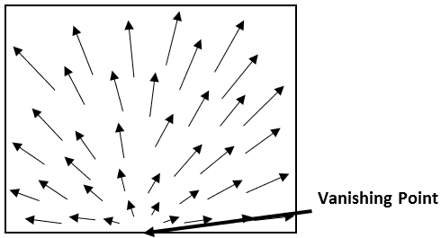

## How RobleyVision Works

RobleyVision works by comparing the images it is receiving from the camera to the current frame of the training video, to see how it needs to move so that the view from the camera matches the target frame.  Once the target and camera frames look sufficiently similar RobleyVision moves on to the next frame of the training video, gradually making its way through every frame of the video until it reaches its destination. 

The software compares two images by looking for distinctive feature points (such as the corners of objects) in them and matching up corresponding pairs of key points between the two images.  This allows the software to observe how the key points have moved between the images, and thereby work out how the robot must move to reduce the difference in position of the key points between the images.

The image below shows the results of matching key points between an image from the camera and a target frame from the training video.  Each arrow points from a key point’s position in the camera frame to its position in the target frame.  Note how most of the key points are located on distinctive features in the image.

We can see from the above image that the key points have moved to the left between the camera and target frames; this shows that the scene has moved to the left relative to the robot, therefore the robot must move to the right relative to the scene in order for the frames to match.  If the movement vectors had been pointing to the right then the robot would need to move to the left.

When the robot moves forwards or backwards, the keypoints move away from or towards the vanishing point of the image respectively, as objects appear to grow from/shrink into the distance.  Normally it would be fairly difficult to work out whether the flow vectors are pointing towards or away from the vanishing point, however RobleyVision simplifies this by using a camera that is angled slightly upwards, so that the vanishing point is at the bottom of the image.  This means that it is possible to work out whether the robot should drive forwards or backwards based on whether the flow vectors are pointing up or down, as shown below:

In this example the keypoints have moved predominantly upwards between the camera and target frames, meaning that they have moved away from the vanishing point and the robot must move forwards into the scene for the frames to match.  The robot would need to move backwards had the vectors been pointing downwards and into the vanishing point.

RobleyVision works out which direction the flow vectors are pointing in by subtracting the positions of each key point in the camera frame from their position in the target frame, and finding the median x and y coordinates of the vectors.  The median is used rather than the mean as it reduces the impact of outliers caused by incorrect matchings.  Once a single median flow vector has been found, it is simple to check the x and y components of this vector to work out what forwards/backwards and left/right velocities the robot should have, and the powers of the left and right motors can be set accordingly.
